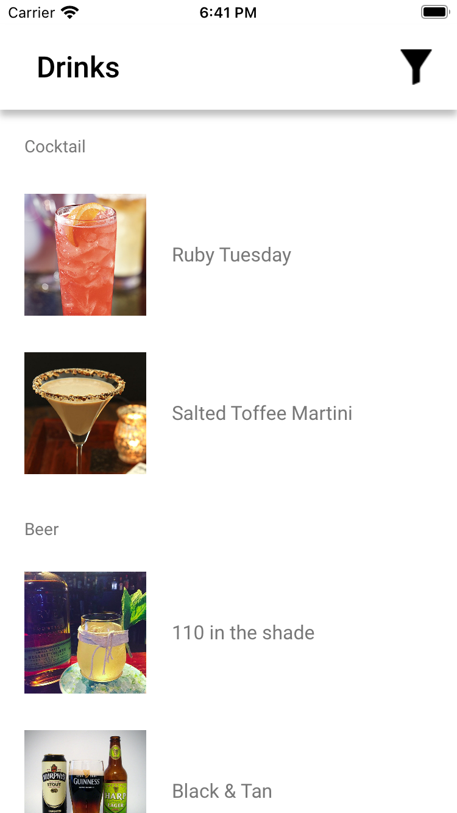
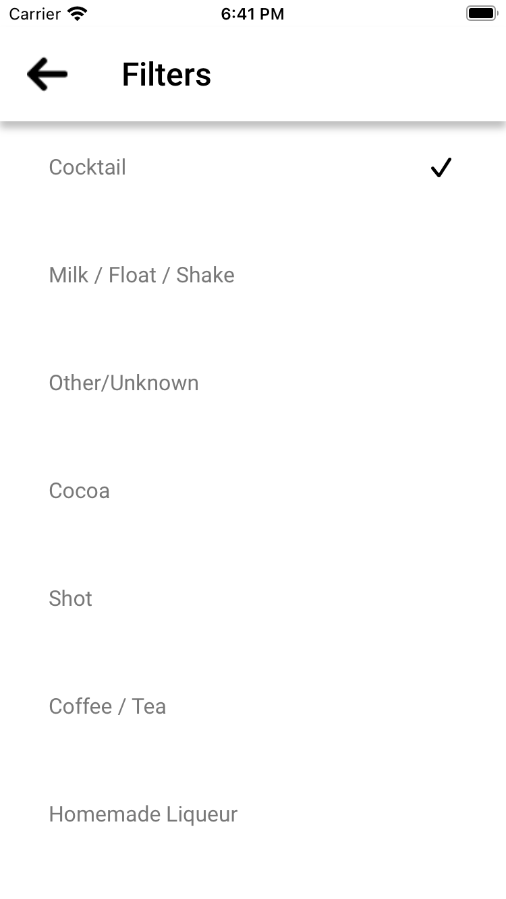
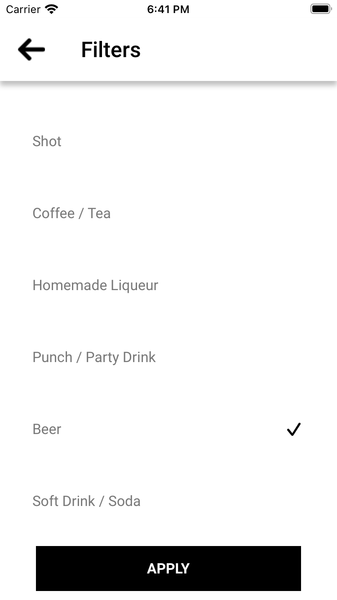

# CocktailDB

Mobile application for obtaining data on alcoholic beverages using the open API

    
    
    

## Getting Started

    

An open, crowd-sourced database of drinks and cocktails from around the world.
We also offer a free JSON API for anyone wanting to use it.
If you like the site, please consider supporting us on Patreon by clicking the link below...
You can get one here: [get CocktailDB API](https://www.thecocktaildb.com/api.php).

# Installation
1. Install Cocoapods: sudo gem install cocoapods
2. Update pods in folder: pod update
3. Install [Moya](https://github.com/Moya/Moya#cocoapods)
4. Install [SDWebImage](https://github.com/SDWebImage/SDWebImage#installation)
5. Build project from Xcode.
